# CompiSMART

<p align="center">
  <strong>Compare a YouTube Short and an Instagram Reel with transcript-aware creator intelligence.</strong>
</p>

<p align="center">
  
  
  
  
</p>

CompiSMART is a full-stack analysis workspace for short-form video comparisons. Drop in one YouTube Short and one Instagram Reel; the app fetches public metadata, extracts or generates transcripts, calculates engagement, builds a session-scoped retrieval index, and streams grounded AI answers with citations.

It is built for creator-performance questions like:

- Which video has the stronger hook?
- Why did one video perform better?
- Is the pacing clear or chaotic?
- What should the creator change next?
- Which evidence supports the answer?

## Experience

CompiSMART is not a generic chatbot wrapped around two URLs. The workspace is shaped around comparison:

| Layer | What It Does |
| --- | --- |
| Video dossiers | Side-by-side metadata, engagement, warnings, thumbnails, captions, and transcript previews |
| Real progress | The frontend follows live backend phases through Server-Sent Events, including long Whisper transcription |
| Transcript RAG | Chunks are embedded and retrieved per session so answers cite the relevant evidence |
| Streaming chat | Cohere streams Markdown answers with headings, bullets, tables, and source citations |
| Graceful fallback | Missing captions, metrics, vectors, or model access are surfaced instead of hidden |

## Flow

```mermaid
flowchart LR
    A[Creator adds two public video URLs] --> B[Live analysis stream]
    B --> C[YouTube metadata and subtitle enrichment]
    B --> D[Instagram Reel metadata and media URL]
    C --> E[Transcript resolver]
    D --> E
    E --> F[Whisper fallback when captions are missing]
    F --> G[Engagement and transcript chunks]
    G --> H[Cohere embeddings]
    H --> I[ChromaDB session index]
    I --> J[Streaming analysis chat]
    J --> K[Markdown answer with citations]

    classDef input fill:#f0f9ff,stroke:#0284c7,color:#0f172a;
    classDef process fill:#f8fafc,stroke:#64748b,color:#0f172a;
    classDef ai fill:#f5f3ff,stroke:#7c3aed,color:#0f172a;
    classDef output fill:#ecfdf5,stroke:#059669,color:#0f172a;

    class A,B input;
    class C,D,E,G process;
    class F,H,I,J ai;
    class K output;
```



## Stack

| Area | Tools |
| --- | --- |
| Frontend | React, TypeScript, Vite, custom CSS, lucide icons |
| Backend | FastAPI, Pydantic, httpx, Server-Sent Events |
| Providers | YouTube Data API, Apify, Cohere |
| Transcripts | YouTube captions, Apify subtitles, yt-dlp, Whisper `small` |
| Retrieval | LangChain text splitting, Cohere embeddings, ChromaDB |
| Runtime memory | In-process session state for MVP chat continuity |

## Local Setup

### Backend

```bash
cd backend
bash scripts/bootstrap_backend.sh
source .venv/bin/activate
cp .env.example .env
uvicorn app.main:app --reload --port 8000
```

Set these in `backend/.env`:

```bash
YOUTUBE_API_KEY=...
APIFY_TOKEN=...
COHERE_API_KEY=...

APIFY_INSTAGRAM_ACTOR=apify/instagram-scraper
APIFY_YOUTUBE_VIDEO_ACTOR=streamers/youtube-scraper
APIFY_YOUTUBE_SHORTS_ACTOR=streamers/youtube-shorts-scraper

COHERE_CHAT_MODEL=command-a-plus-05-2026
COHERE_EMBED_MODEL=embed-english-v3.0

WHISPER_MODEL_SIZE=small
WHISPER_LANGUAGE=hi
WHISPER_INITIAL_PROMPT=This audio may contain Hindi, Hinglish, or English. Transcribe the spoken words accurately; do not translate.
```

`WHISPER_LANGUAGE=hi` is useful for Hindi or Hinglish reels because auto-detection can confuse short noisy clips with another language. Leave it blank if you want Whisper to auto-detect language.

`YTDLP_COOKIES_PATH` is optional. Use it only when YouTube blocks unauthenticated media fallback and you have a valid exported cookies file.

### Frontend

```bash
cd frontend
npm install
npm run dev
```

Open `http://localhost:5173`.

## API Surface

| Endpoint | Purpose |
| --- | --- |
| `GET /health` | Health check |
| `POST /analyze` | JSON analysis response |
| `POST /analyze/stream` | Live analysis progress plus final result |
| `POST /chat` | Streaming RAG chat response |
| `GET /media/proxy` | Safe media proxy for remote thumbnails/media |

`/analyze/stream` emits `progress`, `heartbeat`, `result`, `done`, and `error` events. Heartbeats keep the browser connection alive while Whisper downloads, loads, or transcribes.

## Data Integrity

CompiSMART does not invent missing platform metrics. If a provider does not return views, comments, captions, transcript text, or subscriber/follower counts, the app marks the data as unavailable and carries that uncertainty into the chat answer.

Engagement rate is calculated only when the required public metrics exist:

```text
(likes + comments) / views * 100
```

## Repository

| Path | Purpose |
| --- | --- |
| `backend/app/api/routes` | FastAPI endpoints |
| `backend/app/services` | YouTube, Instagram, transcript, RAG, vector, and memory services |
| `backend/app/schemas` | Typed request and response models |
| `frontend/src/App.tsx` | Main workspace and chat UI |
| `frontend/src/lib` | API client, types, and formatters |
| `frontend/src/styles/main.css` | Product styling |

## Notes

- Whisper `small` is slower than `tiny`, but much more reliable for noisy short-form speech.
- The first Whisper `small` run downloads the model, then later runs reuse the local cache.
- ChromaDB and in-memory sessions are intentionally local-first for the MVP.
- A production version should move sessions to Redis/Postgres and vectors to Qdrant, pgvector, or managed Chroma.

## Demo Flow

1. Add one public YouTube Short.
2. Add one public Instagram Reel.
3. Click **Analyze Videos**.
4. Watch the real backend progress stream.
5. Compare the two video dossiers.
6. Ask questions like:
   - `Compare clarity and pacing`
   - `Why did Video B perform better?`
   - `Show the engagement metrics in a table`
   - `Suggest improvements for Video A`
